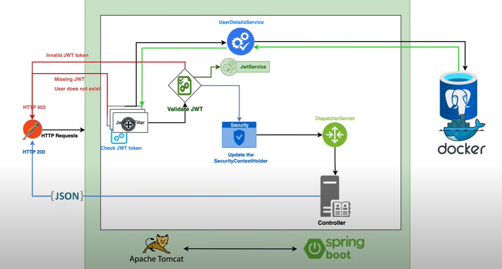

# SpringBootSecurity
This repo implements various exercises connected to Spring Boot Security components.

## Base schema

## Components
* User registration and login with JWT authentication
* Password encryption using BCrypt
* Role-based authorization with Spring Security
* Customized access denied handling
* Logout mechanism
* Refresh token
* Audit
* JPA Postgres database connection

 